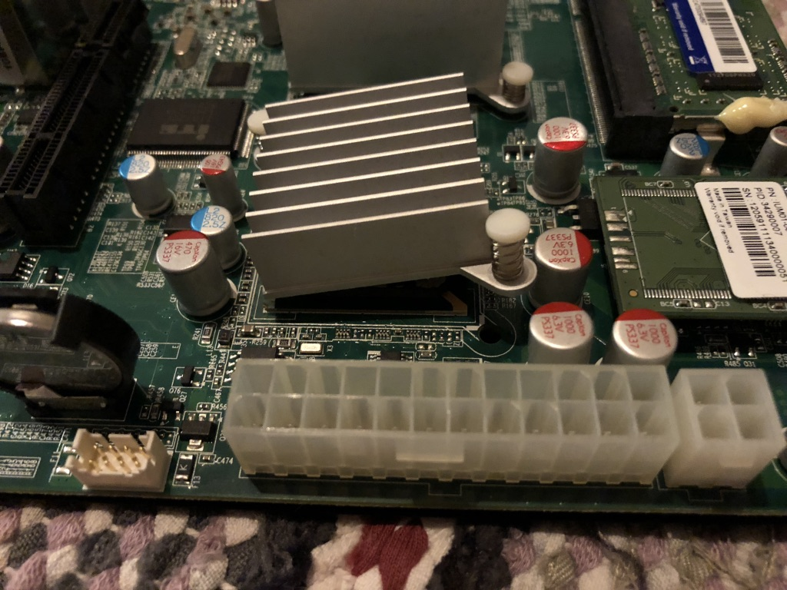

# ASUSTOR AS-6XXT

This repo contains my notes and debugging data from turning an ASUSTOR AS-604T into a Debian machine (almost fully featured).

It's an unordered mess.

There be dragons.

Proceed at your own peril.

## Why did I start this?

Well, this had happened by itself:

And the AS-6XXT series runs a kernel that's TOO... DAMN... OLD. It's 3.12.20 if you must know.

So, I fixed the heatsink and got to work.

### Progress

Pretty much everything I need is working.

#### What works

* Heat sensors
* Automatic fan speed
* Turning leds on/off
* LCD (working on a separate project for this)
    * Writing text
    * Reading button input
    * What else is missing?

#### What doesn't

* Turning of the HDD leds (need to access Marvell chip)
* System buzzer (via it87 chip)
* Blinking leds (this should could be achived relatively easily)
* What else?

#### My setup

If you're interested.

* Boot via external USB drive
    * Contains `/boot/asloader.efi`
    * I re-purposed the 4th parititon of internal flash for `/boot`, it used to contain the stock App Central package bundle
* Debian with full disk encryption (raid-1)
    * Unlock via SSH
* A second raid-1 (scratch disk)
* Looking for replacement RAM
    * My 2GB module (KVR1333D3S8S9) causes the system to slow to a crawl :(
    * Maybe remove internal 1GB for a total of 4GB
